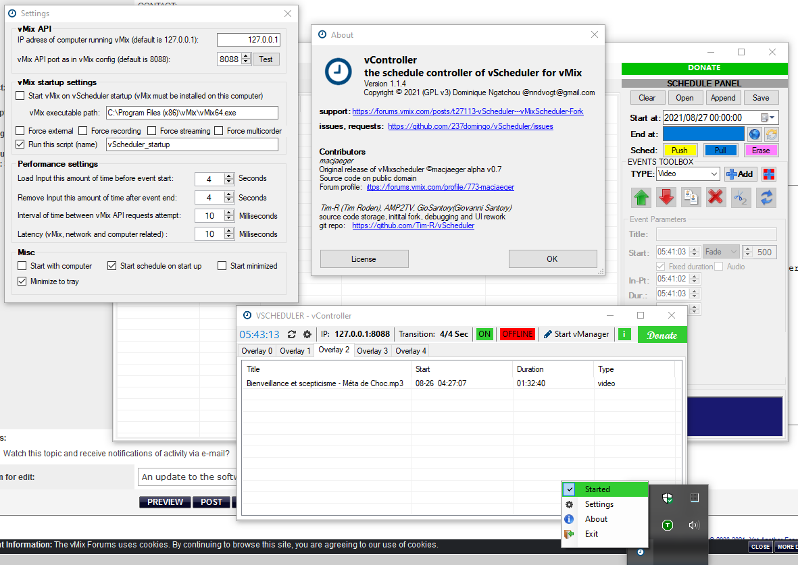

WELCOME

# What is vScheduler for vMix
* * *
vScheduler for vMix  is an automated way to schedule programming(such as videos, images, audio clips, and more) for playback in vMix. It is a fork of a similar project called vMixScheduler. There are two parts to the program: vController and vManager

**vManager** 

Use it to create the list of content each day. The schedule starts at a set time and runs until the last item in the list is finished. The files can be saved in XML format to be edited or aired later. 

**vController**

Here is the brain of the whole operation. It's responsible for loading and unloading content from vMix and playing it back at the right times. Together, these two programs make up the vScheduler system.

# Features
* * *
# Downloads
* * *
## Latest
**Download:** [vScheduler for vMix v1.1.4-alpha.3+builddate300821.zip](https://github.com/237domingo/vScheduler/releases/download/v1.1.4-alpha.3/v1.1.4-alpha.3+builddate300821.zip)

**CHANGELOG:**
> **vManager 1.1.4-alpha.3+builddate30082021**
> 1. **[FIX]** Correcting the copy/paste bug
> 
> **vController 1.1.4-alpha.3+builddate30082021**
> 1. **[FIX]** Correcting the "vManager couldn't be found" bug

## v1.1.4-alpha.2
**Download:** [vScheduler.v1.1.4-alpha.2+builddate260821.zip](https://github.com/237domingo/vScheduler/releases/download/v1.1.4-alpha.2/vScheduler.v1.1.4-debug.2+buiddate260821.zip)

**CHANGELOG:**
> **vManager 1.1.4-alpha.2+builddate26082021**
> 1. **[KNOWN ISSUE]** When copy/cut and paste an event from one overlay to another overlay, the new event created keeps the copied overlay number internally. If you save and load the schedule those events will be in the wrong overlay. + All the events copied are linked: if you edit one the other will change at the same time. Be aware.
> 1. **[KNOWN ISSUE]** when the start vManager couldn't find vManager.exe (this append when when vController start automatically on computer startup)
> 1. **[KNOWN ISSUE]** Some command failed when vMix is on heavy load or when the computer is on heavy load 
> 1. **[COMPATIBILITY]** Compatible with previous version of vManager 1.0.0 (can read/write schedule file)
> 1. **[COMPATIBILITY]** Not compatible with previous version of vController 1.0.0 (bug occurs when using schedule generated with previous versions)
> 1. **[FEATURE]** Implementing library features. Now user can choose, by clicking on the schedule/library submenu a list on folders where the program is going to seek for missing files.
>  - add/remove/update folders in library
>  - Fix path/fix all path option for correcting missing files path
>  - Auto fix path on load option to adjust files path when the user load a schedule
> 1. **[FEATURE]** Two new menus on context menu to fix missing files path and open file's location
> 1. **[FEATURE]** Fix path when pushing to vController to avoid missing files/path related bugs in vController
> 1. **[FEATURE]** Event with missing media files are colored in red
> 1. **[IMPROVEMENT]** Pull now work (was not implemented in previous versions)
> 1. **[FEATURE]** "About" box added in the "HELP" menu
> 1. **[FIX]** Remove useless control from the UI
> 1. **[FIX]** Fixing The loop feature for slideshow events
> 1. **[FEATURE]** Color event: now the user can select a custom color to display
> 1. **[FIX]** Fixing the type of color event
> 1. **[FIX]** Adjusting default value of events with more accurate one
> 1. **[FEATURE]** Ability to preview events media file in the PREVIEW box (images and color type only for now)
> 1. **[FIX]** Fixing bugs where some event's settings will not be saved in or loaded from the schedule xml file
> 1. **[UI]** ui rework, icon added, some tooltips added
> 1. **Many other bugs remove**
> 
> **vController 1.1.4-alpha.2+builddate26082021**
> 1. **[COMPATIBILITY]** Not compatible with previous version of vController 1.0.0 (bug occurs when using schedule generated with previous versions)
> 1. **[FEATURE]**  Start/Stop vController button: vController will only start pushing event to vMix if vMix Api is detected and this button is on
> 1. **[FEATURE]** Button to start vManager from vController
> 1. **[FEATURE]** "About" box added
> 1. **[FEATURE]** Red/Green button added to view in real time the state of vMix Api
> 1. **[FEATURE]** New tray view with right click menu (close, About, Settings, Start vController) access
> 1. **[FEATURE]** New vController settings added
>  - Run vMix when vScheduler start
>  - setting the path of vMix executable
>  - Run vController when computer start
>  - Minimize vScheduler on tray
>  - Force vMix to start external, recording, streaming or multicorder when vController is connected to vMix (all those
>  - Run once a named script (must be one of the script available is the setting panel/scripting menu) every time vController start to push schedule to vMix
> 1. **[FIX]** Double input bug resolve
> 1. **[FIX]** Remove automatic ask for admin rights, user have to do it manually
> 1. **[FIX]** Fixing operator(manual) event not removing/stoping the previous input created by vController and creating black input in vMix
> 1. **[FIX]** Fixing color event only showing black, now can display any color
> 1. **[FIX]** Fixing audio event issue where continuing to play sound after another event has started
> 1. **[FIX]** Fixing issue where clock frequenly freezes for many seconds
> 1. **[FIX]** Two instances of vController can no longer be running at the same time
> 1. **[FIX]** Fixing issue where ui will freeze when opening/closing setting panel  of vController or the main program
> 1. **[FIX]** Random crashes reduced when vMix Api commands don't respond or responds too late, and many others situation
> 1. **[FIX]** Fixing vController.exe 
> 1. **[IMPROVEMENT]** Network load and delay reduced
> 1. **[IMPROVEMENT]** Stability improvement (run for longer period of time without freezing or crashes
> 1. **[UI]** ui rework, icon added, some tooltips added
> 1. **A lot more fixes**

## v1.0.0.debug.2
**Download:** [vScheduler v1.0.0-debug.2+builddate130621](https://github.com/237domingo/vScheduler/releases/download/v1.0.0-debug.2+builddate130621/vScheduler.zip)

**CHANGELOG:**
> **FOR TESTING PURPOSE ongoing work**
> **vController v1.0.0-debug.2+builddate130621**
> 1. Remove mediainfo references from vController
> 1. fixing bug
> 
> **vManager v1.0.0-debug.2+builddate130621**
> 1. Add entry in settings file for recent files
> 1. Now display the current edited playlist name
> 1. Prompt to save when closing, creating or opening a playlist
> 1. Append function now only append the selected overlay content from the selection box to the current displayed overlay
> 1. Adding export submenu to the file menu
> 1. Adding recent files list to the file menu
> 1. Fix some bug in Schedule Panel
> 1. Renaming Edit menu to Events and Tools to Schedule
> 1. UI fixing
> 1. Other bug fixing
> 1. **STILL ONGOING TESTER NEEDED**

## v1.0.0.debug.1
**Download:** [vScheduler v1.0.0-debug.1+builddate080621](https://github.com/237domingo/vScheduler/releases/download/v1.0.0-debug.1+builddate080621/vScheduler.zip)

**CHANGELOG:**
> **For testing purpose: Some drastics changes made to the code**
> **vController v1.0.0-debug.1+builddate080621**
> 1. Add a vMix address settings and ability to control vMix on another pc
> 1. Remove "Mix" from name of classes and properties of project
> 1. Add ability to control multiples overlays
> 1. Adding 4 more tabs to the controler for overlays
> 1. Others minor stuffs on vControler
> 
> **vManager v1.0.0-debug.1+builddate080621**
> 1. Redesign UI of vManager (adding icons, remove useless button, adding a menu ...)
> 1. Add ability of managing multiples overlays
> 1. Add a context menu
> 1. Rewrite some functions for multiselection purpose
> 1. Add new functions
> 1. STILL ONGOING NEED TESTERS

## v1.0
**Download:** [vMixScheduler v1.0](https://github.com/Tim-R/vScheduler/releases/download/v1/vMixScheduler.zip)

**CHANGELOG:**
> 1. Storing initial source code from macjaeger on the git
> 1. Changes to vWebClient

# Gallery
* * *

# Support
* * *
#### Having trouble? Find a bug? Want to dig into dev?
* Check out our [documentation](./documentation.html)
* Join the [discussion on the project git](https://github.com/237domingo/vScheduler/discussions)
* Check out the [vMix forum topic](https://forums.vmix.com/posts/t27113-vScheduler---vMixScheduler-Fork)

# Contact & donations
* * *
- **CONTACT:** [nndvogt@gmail.com](mailto:nndvogt@gmail.com)
- **PAYPAL:** [PAYPAL](https://www.paypal.com/donate?hosted_button_id=8KWHCKS3TX54S) and we’ll help you sort it out.
- **PHONE MM:** [+237 692 89 87 48](http://00237692898748)
- **CRYPTO:**
  - BITCOIN: [3MrWcCrMTV2jRMui7EMuC9uQGeNjvxYHh8](http://3MrWcCrMTV2jRMui7EMuC9uQGeNjvxYHh8)
  - ETHEREUM: [0x1154740bc56Aa63Cf578674290B49290cDb781ea](http://0x1154740bc56Aa63Cf578674290B49290cDb781ea)
