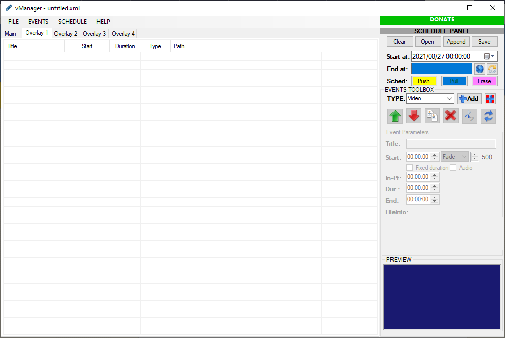
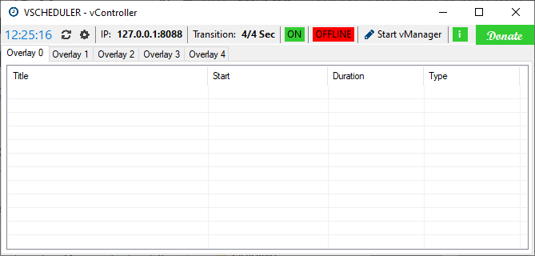

# What is vScheduler
* * *
vScheduler is an automated way to schedule programming(such as videos, images, audio clips, and more) for playback in vMix. It is a fork of a similar project called vMixScheduler. There are two parts to the program: vController and vManager

**vManager** 

Use it to create the list of content each day. The schedule starts at a set time and runs until the last item in the list is finished. The files can be saved in XML format to be edited or aired later. 

**vController**

Here is the brain of the whole operation. It's responsible for loading and unloading content from vMix and playing it back at the right times. Together, these two programs make up the vScheduler system.

# Features
* * *
# Downloads
* * *
## latest

## v1.0.0.debug.3

## v1.0.0.debug.2

## v1.0

# Gallery
* * *
[vmanager ui.png](./assets/images/vmanager ui.png)

# Support
* * *
#### Having trouble? Find a bug? Want to dig into dev?
* Check out our [documentation](./documentation.html)
* Join the [discussion on the project git](https://github.com/237domingo/vScheduler/discussions)
* Check out the [vMix forum topic](https://forums.vmix.com/posts/t27113-vScheduler---vMixScheduler-Fork)

# Contact & donations
* * *
- **CONTACT:** [nndvogt@gmail.com](mailto:nndvogt@gmail.com)
- **PAYPAL:** [PAYPAL](https://www.paypal.com/donate?hosted_button_id=8KWHCKS3TX54S) and we’ll help you sort it out.
- **PHONE MM:** [+237 692 89 87 48](http://00237692898748)
- **CRYPTO:**
  - BITCOIN: [3MrWcCrMTV2jRMui7EMuC9uQGeNjvxYHh8](http://3MrWcCrMTV2jRMui7EMuC9uQGeNjvxYHh8)
  - ETHEREUM: [0x1154740bc56Aa63Cf578674290B49290cDb781ea](http://0x1154740bc56Aa63Cf578674290B49290cDb781ea)
